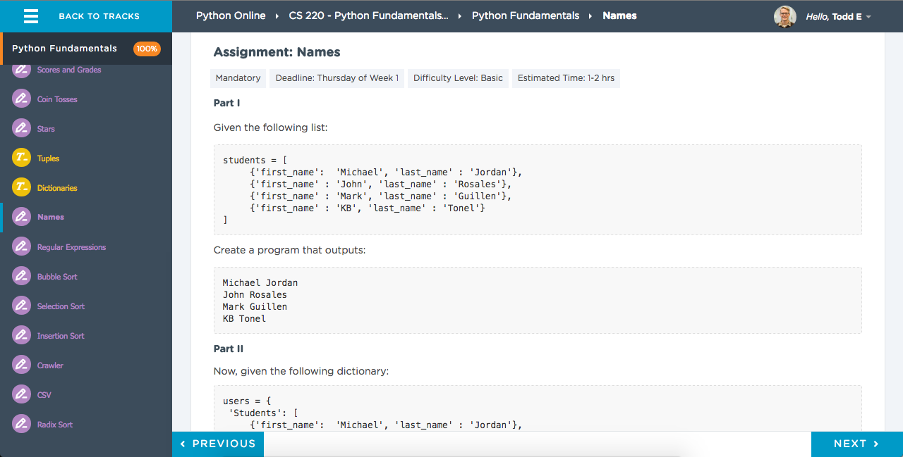

#Python Fundamentals Lecture 2

####Key Assignment This Week
- <b>Names</b>


####Less Talk More Loops
- Let's see how a for loop works again.
```python
for num in range(0,5):
  print num

myDictionary = {
  'name': 'Todd',
  'location': 'Warshington'
}
for key in myDictionary:
  print key #Are we printing keys or values?
```
####Functions, Dictionaries, Tuples
- Functions
  - What are they good for?
    - DRY principle
    - Example

- Dictionaries
  - What are they good for?
    - Key-Value pair indexing
    - What order are they in?

- Tuples
  - What are they good for?
    - Immutable Sequence
    - Keep their order (hence sequence)
    - Swaps are easier
```python
myTuple = ('Me', 'You', 'We')
#Looping
for val in myTuple:
  print val

#Accessing
print myTuple[2]

#Unpacking: Use a Tuple to unpack a Tuple
(x, y, z) = myTuple

print x, y, z
```
####Q&A

####Demo
- Draw Stars
